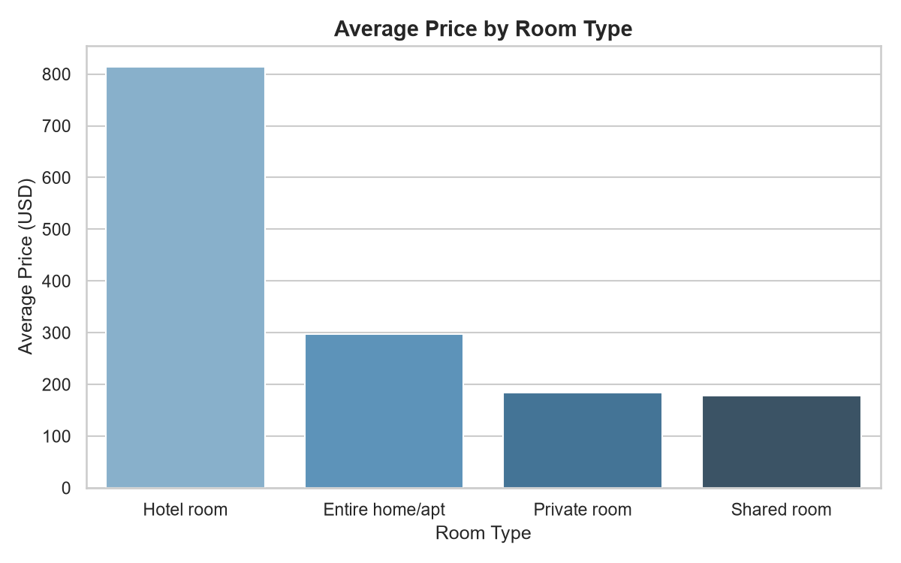
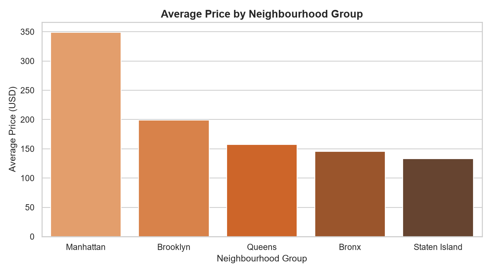
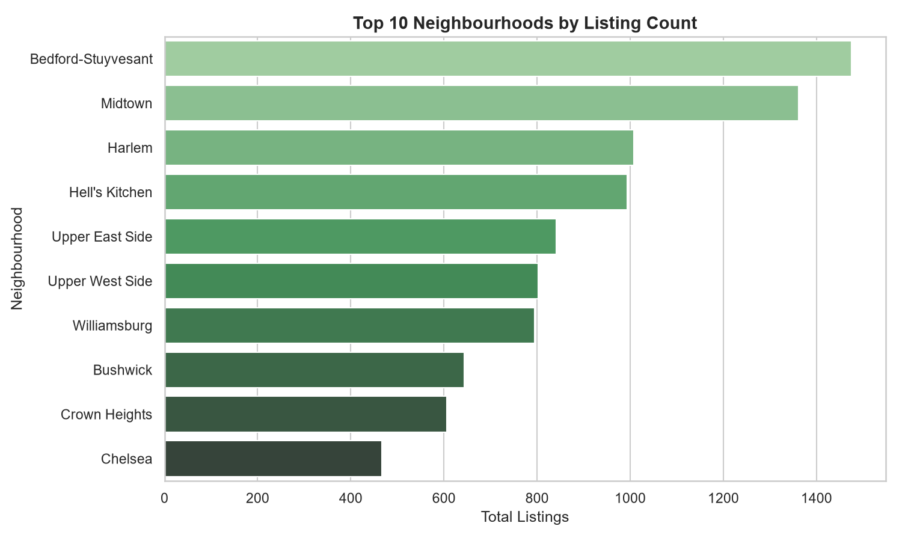
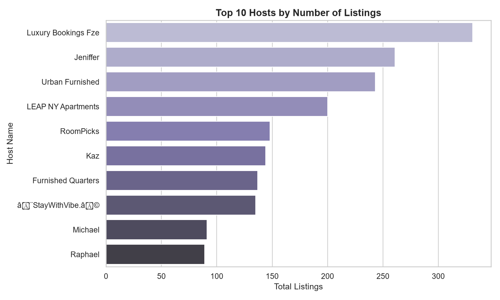
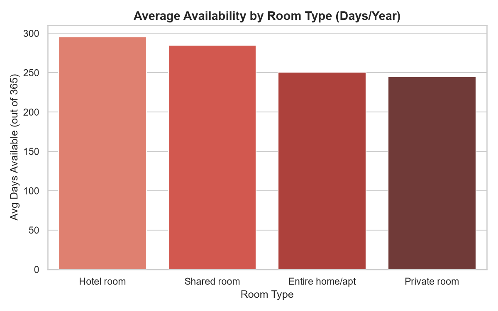

# Airbnb Market Analytics

This is my first data project. I built a complete data pipeline that takes raw Airbnb listing data from New York City and analyzes it to find insights about pricing, neighbourhoods, hosts, and availability.

I used Python to clean the data, MySQL to store it, SQL to analyze it, and Matplotlib to visualize the results.

---

## Tools and Technologies

- Python
- Pandas
- MySQL
- SQL
- Matplotlib
- Seaborn

---

## Project Structure

airbnb-market-analytics

├── data/
│   ├── listings.xlsx
│   ├── listings_clean.csv
│   └── listings_clean_utf8.csv

├── analysis/
│   ├── day1_check.py
│   ├── day2_clean_data.py
│   ├── day3_load_mysql.py
│   ├── day4_analysis.py
│   └── day5_visualizations.py

├── sql/
│   └── day4_queries.sql

├── images/
├── requirements.txt
└── README.md

---

## How I Built This

**Day 1 - Exploration**
I loaded the raw Excel file using Pandas and explored it to understand what columns were available, how many rows there were, and what the data looked like before touching anything.

**Day 2 - Cleaning**
I kept only the 11 columns that were actually useful for analysis and removed rows where price or neighbourhood was missing. Then I exported the cleaned data as a CSV file with UTF-8 encoding so it would work correctly with MySQL.

**Day 3 - Database**
I created a MySQL database called airbnb_analytics and a table called listings. Then I used Python to connect to MySQL and load all 20,693 cleaned rows into the table. I verified the import by checking that the row count matched on both sides.

**Day 4 - Analysis**
I wrote 9 SQL queries to pull out insights from the data. Things like average price by room type, top 10 most expensive neighbourhoods, which hosts have the most listings, and availability patterns across different room types.

**Day 5 - Visualizations**
I used Matplotlib and Seaborn to turn the SQL query results into bar charts and saved them as PNG image files into the images folder.

---

## What I Found

## What I Found

- Hotel rooms are the most expensive room type with an average price of $814 which makes sense as they are professionally managed properties
- Entire home and apartment listings average $298 which is significantly higher than private rooms at $185
- Manhattan is the most expensive borough with an average price of $349 followed by Brooklyn at $199
- Fort Wadsworth in Staten Island has the single highest average price at $1010 but only has 1 listing so it is not very reliable as a data point
- Tribeca in Manhattan is the most expensive neighbourhood with meaningful listings at an average of $842
- Bedford-Stuyvesant in Brooklyn has the highest number of listings at 1475 followed by Midtown Manhattan at 1362
- Luxury Bookings Fze is the top host with 331 listings which clearly indicates a professionally managed operation rather than an individual host
- Only 1 listing is fully booked all year while 2536 listings are available all 365 days suggesting a large portion of hosts are not getting consistent bookings
- Hotel rooms have the highest average availability at 296 days per year which is expected since hotels are always open for booking

---

## Charts

### Average Price by Room Type

### Average Price by Neighbourhood Group

### Top 10 Neighbourhoods by Number of Listings

### Top 10 Hosts by Number of Listings

### Average Availability by Room Type

---

## How to Run This Project

Install the required libraries:

pip install -r requirements.txt

Open MySQL Workbench and run the SQL inside sql/day4_queries.sql to create the database and table.

In day3_load_mysql.py, day4_analysis.py, and day5_visualizations.py replace YOUR_PASSWORD with your MySQL root password.

Then run the scripts in this order:

python analysis/day1_check.py
python analysis/day2_clean_data.py
python analysis/day3_load_mysql.py
python analysis/day4_analysis.py
python analysis/day5_visualizations.py

---

## Dataset

NYC Airbnb Open Data. A publicly available dataset containing Airbnb listings from New York City with details on pricing, location, room type, host information, and availability.

---

## Author

Palak
GitHub: https://github.com/Palak1711